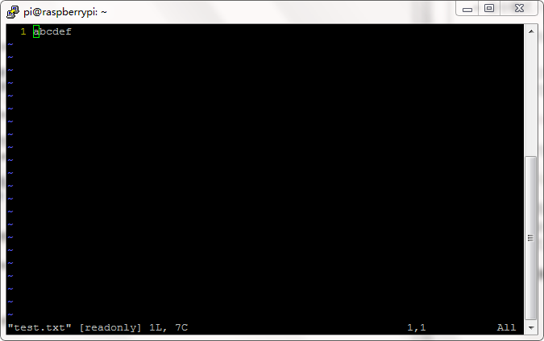
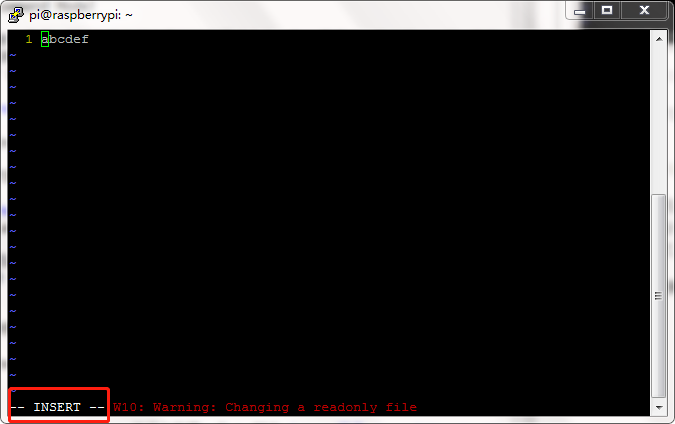
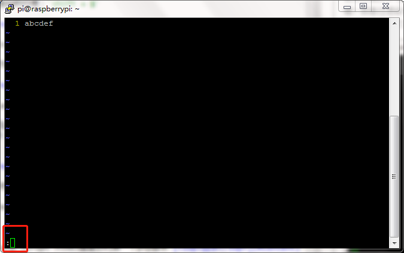

<a name="content">目录</a>

[学习笔记：PHP一周速成](#title)
- [写在前面](#firstly)
	- [测试Web服务器是否work](#test-web-server)
	- [测试PHP是否work](#test-php)
	- [web服务器默认工作目录](#web-server-workdir-default)
	- [linux文本编辑器的简单介绍](#txt-editor-introduct)
		- [nano](#nano)
		- [vim](#vim)
	- [编辑你的第一个php脚本](#edit-php-script)
- [PHP 语法](#syntax)
- [变量](#variable)
	- [变量作用域](#variable-scope)
- [echo 和 print 语句](#echo-print)
- [EOF(heredoc)](#heredoc)
- [数据类型](#data-types)
- [运算符](#operator)
- [数据结构](#data-structure)
	- [常量](#constant)
	- [超级全局变量](#super-global-variable)
	- [魔术变量](#magic-variable)
	- [字符串变量](#string)
	- [数组](#array)
		- [数组排序](#array-sort)
- [条件判断](#condition-judgment)
- [循环](#loop)
- [函数](#function)
- [命名空间(namespace)](#namespace)
	- [子命名空间](#sub-namespace)
	- [命名空间使用](#use-namespace)
- [面向对象](#Object-oriented)


<h1 name="title">学习笔记：PHP一周速成</h1>

<a name="firstly"><h3>写在前面 [<sup>目录</sup>](#content)</h3></a>

<a name="test-web-server"><h4>测试Web服务器是否work [<sup>目录</sup>](#content)</h4></a>

在浏览器地址栏输入`ip:port`，回车。ip为树莓派服务器ip，port为树莓派服务器的web服务端口，比如ip为：124.16.111.23，port为9000，则输入：`124.16.111.23:9000`

若打开以下界面则说明Web服务器正常运行

<p align="center">

<a name="test-php"><h4>测试PHP是否work [<sup>目录</sup>](#content)</h4></a>

在浏览器地址栏输入`ip:port/phptest.php`

若打开以下界面则说明PHP正常运行

<p align="center">

<a name="web-server-workdir-default"><h4>web服务器默认工作目录 [<sup>目录</sup>](#content)</h4></a>

web服务器默认工作目录：直接在浏览器地址栏输入`ip:port`后，所进入的服务器文件系统的路径

默认工作目录为 `/var/www`

比如有以下树形结构的文件路径

```
/var/www/
|-- bioinfo-course
|-- html
|	|-- login1.html
|	|-- login.php
```
如果你想在浏览器上打开文件`login1.html`，怎么实现？
> 1. 用`ip:port`进入web服务器默认工作目录`/var/www`
> 2. 添加`login1.html`文件对应默认工作目录的相对路径：`html/login1.html`
> 3. 结合1和2中的信息，构造访问`login1.html`的URL：`ip:port/html/login1.html`

<p align="center">

**注意 ! ! !**

为了更好地归档和管理用户的数据，服务器管理员已经特地在web服务器默认工作目录`/var/www`下，创建了一个专门用于用户学习和练习PHP的文件夹`learningPHP`，请在该文件夹下再创建一个属于用户自己的文件夹，命令参考下面：

```
# 新建文件夹your_new_dir，具体文件夹名自行指定
$ mkdir /var/www/learningPHP/your_new_dir
# 修改文件夹操作权限，关闭同组成员的写权限
$ chmod g-w /var/www/learningPHP/your_new_dir
```

<a name="txt-editor-introduct"><h4>linux文本编辑器的简单介绍 [<sup>目录</sup>](#content)</h4></a>

<a name="nano"><h4>nano [<sup>目录</sup>](#content)</h4></a>

大家在Linux上用的文本编辑器，一般是**Vim**之类的，不过对于初学者可能门槛较高，学起来比较吃力，所以这里给初学者推荐一款比较容易入门上手的编辑器：nano

操作实例（比如有个文件`test.txt`)：
```
$ nano test.txt
```

<p align="center">

编辑方法：
> - 输入字符：直接敲键盘就行
> - 移动输入位置：键盘中的上下左右键
> - 编辑后保存：`ctrl+x` -> `y` -> 回车

<a name="vim"><h4>Vim [<sup>目录</sup>](#content)</h4></a>

vim是目前Linux操作系统下最流行的几款文本编辑器之一

Vim/vi 是一个功能强大的全屏幕文本编辑器，是 Linux/UNIX 上最常用的文本编辑器，它的作用是建立、编辑、显示文本文件。 Vim/vi 没有菜单，只有命令。

<li />启动Vim

```
$ vim filename
```

界面

<p align="center">

<li />Vim的三种模式及其切换

三种模式：

> - **命令模式**（Command Mode）
> 
> Vim 启动后的默认模式，所输入的任何内容都被解释成命令。在此模式中，用户可以执行一般的
编辑器命令，比如移动光标、删除文本等等。在命令模式中，有很多方法可以进入输入模式，比较普通的方式是按“a”（append，追加）键或者“i”（insert，插入）键。
>
> **在该模式下我一般不会做太多操作，除了一些光标移动操作**
> > - 移动到文件末尾：`shift + g`
> > - 移动到当前行的行首：`shift + ^`
> > - 移动到当前行的行尾：`shift + $`
>
> 
> 
> - **输入模式**（Insert Mode）
> 
> 在此模式中，才能对文本进行正常的编辑
>
> 
> 
> - **末行模式**（Last Line Mode） 
> 
> 在末行模式中可以输入会被解释并执行的命令。例如执行命令（“:”键），搜索（“/”和“?”
键）或者过滤命令（“!”键）。在命令执行之后， Vim 返回到末行模式之前的模式，通常是普通模式（命令模式）。
>
> **在该模式下我一般不会做太多操作，除了保存文件及退出**
> > - 保存文件：`w`
> > - 退出：`q`
> > - 保存并退出：`wq`
> > - 强制退出，不保存文件：`q!`
> 
> 

三个模式之间的转换

<p align="center">

注意：**输入模式与末行模式之间无法直接转换，需要命令模式作为中介**

<a name="edit-php-script"><h4>编辑你的第一个php脚本 [<sup>目录</sup>](#content)</h4></a>

打开文本编辑器，这里以nano为例，这里将文件命名为`test.php`（文件名自行定义，但后缀必须是php）：

```
$ nano /var/www/learningPHP/lianm/test.php
```

然后在编辑器中输入以下PHP脚本语句

```
<?php
echo "Hello World!";
?> 
```

然后保存：`ctrl+x` -> `y` -> 回车。

在浏览器中访问你刚才编辑好的php脚本，在浏览器地址栏输入该脚本的URL：`124.16.111.23:9000/learningPHP/lianm/test.php`

<p align="center">

运行成功，congratulation ！ ！ ！

<a name="syntax"><h3>PHP 语法 [<sup>目录</sup>](#content)</h3></a>

<li>基本的 PHP 语法：</li>

```
<?php
// PHP 代码
?> 
```

PHP 中的每个代码行都**必须以分号结束**。分号是一种分隔符，用于把指令集区分开来。

通过 PHP，有两种在浏览器输出文本的基础指令：echo 和 print。
<br>
<li>注释</li>

```
<?php
// 这是 PHP 单行注释

/*
这是
PHP 多行
注释
*/
?>
```

<a name="variable"><h3>变量 [<sup>目录</sup>](#content)</h3></a>

```
<?php
$x=5;
$y=6;
$z=$x+$y;
echo $z;
?>
```

<a name="variable-scope"><h4>变量作用域 [<sup>目录</sup>](#content)</h4></a>

<li>全局变量</li>

在所有函数外部定义的变量，拥有全局作用域。要在一个函数中访问一个全局变量，需要使用 global 关键字。 

```
<?php
$x=5;
$y=10;
 
function myTest()
{
    global $x,$y;
    $y=$x+$y;
}
 
myTest();
echo $y; // 输出 15
?>
```

PHP 将所有全局变量存储在一个名为 $GLOBALS[index] 的数组中。 index 保存变量的名称。这个数组可以在函数内部访问，也可以直接用来更新全局变量。

```
<?php
$x=5;
$y=10;
 
function myTest()
{
    $GLOBALS['y']=$GLOBALS['x']+$GLOBALS['y'];
} 
 
myTest();
echo $y;
?>
```

<br>
<li>局部变量</li>

在 PHP 函数内部声明的变量是局部变量，仅能在函数内部访问

<br>
<li>Static 作用域</li>

当一个函数完成时，它的所有变量通常都会被删除。然而，有时候您希望某个局部变量不要被删除。

要做到这一点，请在您第一次声明变量时使用 static 关键字：

```
<?php
function myTest()
{
    static $x=0;
    echo $x;
    $x++;
}
 
myTest();
myTest();
myTest();
?>

# 输出结果： 012
```

<a name="echo-print"><h3>echo 和 print 语句 [<sup>目录</sup>](#content)</h3></a>

echo 和 print 区别:

> - echo - 可以输出一个或多个字符串，字符串之间用**逗号**隔开
> - print - 只允许输出一个字符串，返回值总为 1

<a name="heredoc"><h3>EOF (heredoc) [<sup>目录</sup>](#content)</h3></a>

```
<?php
echo <<<EOF
    <h1>我的第一个标题</h1>
    <p>我的第一个段落。</p>
EOF;
// 结束需要独立一行且前后不能空格
?>
```

> 1. 必须后接分号，否则编译通不过。
> 2. EOF 可以用任意其它字符代替，只需保证结束标识与开始标识一致。
> 3. **结束标识必须顶格独自占一行(即必须从行首开始，前后不能衔接任何空白和字符)。**
> 4. 开始标识可以不带引号或带单双引号，不带引号与带双引号效果一致，解释内嵌的变量和转义符号，带单引号则不解释内嵌的变量和转义符号。
> 5. 当内容需要内嵌引号（单引号或双引号）时，不需要加转义符，本身对单双引号转义，此处相当与q和qq的用法。

<a name="data-types"><h3>数据类型 [<sup>目录</sup>](#content)</h3></a>

<li />字符串

将任何文本放在单引号和双引号中

<li />整型

整型可以用三种格式来指定：十进制， 十六进制（ 以 0x 为前缀）或八进制（前缀为 0）。

var_dump( ) 函数返回变量的数据类型和值

<li />浮点型

浮点数是带小数部分的数字，或是指数形式。

<li />布尔型

布尔型可以是 TRUE 或 FALSE。

<li />数组

数组可以在一个变量中存储多个值。

```
$cars=array("Volvo","BMW","Toyota");
```

<li />对象


在 PHP 中，对象必须声明。首先，你必须使用class关键字声明类对象。类是可以包含**属性**和**方法**的结构。

``` 
<?php
class Car
{
  var $color;
  function Car($color="green") {
    $this->color = $color;
  }
  function what_color() {
    return $this->color;
  }
}
?> 
```

以上实例中PHP关键字this就是指向当前对象实例的指针，不指向任何其他对象或类。

<a name="operator"><h3>运算符 [<sup>目录</sup>](#content)</h3></a>

- 逻辑运算符

> - 与：`and` 或 `&&`
> 
> - 或：`or` 或 `||`
> 
> - 异或：`xor`，有且仅有一个为 true，则返回 true

- 数组运算符

|	运算符	|	名称	|	描述	|
|:---|:---|:---|
|	x + y	|	集合	|	x 和 y 的集合	|
|	x == y	|	相等	|	如果 x 和 y 具有相同的键/值对，则返回 true	|
|	x === y	|	恒等	|	如果 x 和 y 具有相同的键/值对，且顺序相同类型相同，则返回 true	|
|	x != y	|	不相等	|	如果 x 不等于 y，则返回 true	|
|	x <> y	|	不相等	|	如果 x 不等于 y，则返回 true	|
|	x !== y	|	不恒等	|	如果 x 不等于 y，则返回 true	|

- 三元运算符

```
(expr1) ? (expr2) : (expr3) 
```

对 expr1 求值为 TRUE 时的值为 expr2，在 expr1 求值为 FALSE 时的值为 expr3。

自 PHP 5.3 起，可以省略三元运算符中间那部分。表达式 expr1 ?: expr3 在 expr1 求值为 TRUE 时返回 expr1，否则返回 expr3。常用在判断 $_GET 请求中含有 user 值

```
<?php
// 如果 $_GET['user'] 不存在返回 'nobody'，否则返回 $_GET['user'] 的值
$username = $_GET['user'] ?? 'nobody';
// 类似的三元运算符
$username = isset($_GET['user']) ? $_GET['user'] : 'nobody';
?>
```

- 组合比较符(PHP7+)

组合比较运算符，英文叫作combined comparison operator，符号为<=>，它有一个形象的名字，叫作**太空船操作符**。组合比较运算符可以轻松实现两个变量的比较。

```
$c = $a <=> $b
```

> - 如果$a > $b，$c 的值为1
> - 如果$a == $b，$c 的值为0
> - 如果$a < $b，$c 的值为-1

<a name="data-structure"><h3>数据结构 [<sup>目录</sup>](#content)</h3></a>

<a name="constant"><h4>常量 [<sup>目录</sup>](#content)</h4></a>

常量是一个简单值的标识符。该值在脚本中不能改变。常量在整个脚本中都可以使用。

```
define ( string $name , mixed $value [, bool $case_insensitive = false ] )
```

> - name：必选参数，常量名称，即标志符。
> - value：必选参数，常量的值。
> - case_insensitive ：可选参数，如果设置为 TRUE，该常量则大小写不敏感。默认是大小写敏感的。

```
<?php
// 区分大小写的常量名
define("GREETING", "欢迎访问 Runoob.com");
echo GREETING;    // 输出 "欢迎访问 Runoob.com"
echo '<br>';
echo greeting;   // 输出 "greeting"
?>
```

<a name="super-global-variable"><h4>超级全局变量 [<sup>目录</sup>](#content)</h4></a>

PHP中预定义了几个超级全局变量（superglobals） ，这意味着它们在一个脚本的全部作用域中都可用

- **$GLOBALS**

$GLOBALS 是一个包含了全部变量的全局组合数组。变量的名字就是数组的键。

```
<?php 
$x = 75; 
$y = 25;
 
function addition() 
{ 
    $GLOBALS['z'] = $GLOBALS['x'] + $GLOBALS['y']; 
}
 
addition(); 
echo $z; 
?>
```

- **$_SERVER**

$_SERVER 是一个包含了诸如**头信息(header)、路径(path)、以及脚本位置(script locations)**等等信息的数组。这个数组中的项目由 Web 服务器创建。不能保证每个服务器都提供全部项目；服务器可能会忽略一些，或者提供一些没有在这里列举出来的项目。

|	元素/代码	|	描述	|
|:---|:---|
|	$_SERVER['PHP_SELF']	|	当前执行脚本的文件名，与 document root 有关。例如，在地址为 http://example.com/test.php/foo.bar 的脚本中使用 $_SERVER['PHP_SELF'] 将得到 /test.php/foo.bar。__FILE__ 常量包含当前(例如包含)文件的完整路径和文件名。 从 PHP 4.3.0 版本开始，如果 PHP 以命令行模式运行，这个变量将包含脚本名。之前的版本该变量不可用。	|
|	$_SERVER['GATEWAY_INTERFACE']	|	服务器使用的 CGI 规范的版本；例如，"CGI/1.1"。	|
|	$_SERVER['SERVER_ADDR']	|	当前运行脚本所在的服务器的 IP 地址。	|
|	$_SERVER['SERVER_NAME']	|	当前运行脚本所在的服务器的主机名。如果脚本运行于虚拟主机中，该名称是由那个虚拟主机所设置的值决定。(如: www.runoob.com)	|
|	$_SERVER['SERVER_SOFTWARE']	|	服务器标识字符串，在响应请求时的头信息中给出。 (如：Apache/2.2.24)	|
|	$_SERVER['SERVER_PROTOCOL']	|	请求页面时通信协议的名称和版本。例如，"HTTP/1.0"。	|
|	$_SERVER['REQUEST_METHOD']	|	访问页面使用的请求方法；例如，"GET", "HEAD"，"POST"，"PUT"。	|
|	$_SERVER['REQUEST_TIME']	|	请求开始时的时间戳。从 PHP 5.1.0 起可用。 (如：1377687496)	|
|	$_SERVER['QUERY_STRING']	|	query string（查询字符串），如果有的话，通过它进行页面访问。	|
|	$_SERVER['HTTP_ACCEPT']	|	当前请求头中 Accept: 项的内容，如果存在的话。	|
|	$_SERVER['HTTP_ACCEPT_CHARSET']	|	当前请求头中 Accept-Charset: 项的内容，如果存在的话。例如："iso-8859-1,*,utf-8"。	|
|	$_SERVER['HTTP_HOST']	|	当前请求头中 Host: 项的内容，如果存在的话。	|
|	$_SERVER['HTTP_REFERER']	|	引导用户代理到当前页的前一页的地址（如果存在）。由 user agent 设置决定。并不是所有的用户代理都会设置该项，有的还提供了修改 HTTP_REFERER 的功能。简言之，该值并不可信。)	|
|	$_SERVER['HTTPS']	|	如果脚本是通过 HTTPS 协议被访问，则被设为一个非空的值。	|
|	$_SERVER['REMOTE_ADDR']	|	浏览当前页面的用户的 IP 地址。	|
|	$_SERVER['REMOTE_HOST']	|	浏览当前页面的用户的主机名。DNS 反向解析不依赖于用户的 REMOTE_ADDR。	|
|	$_SERVER['REMOTE_PORT']	|	用户机器上连接到 Web 服务器所使用的端口号。	|
|	$_SERVER['SCRIPT_FILENAME']	|	当前执行脚本的绝对路径。	|
|	$_SERVER['SERVER_ADMIN']	|	该值指明了 Apache 服务器配置文件中的 SERVER_ADMIN 参数。如果脚本运行在一个虚拟主机上，则该值是那个虚拟主机的值。(如：someone@runoob.com)	|
|	$_SERVER['SERVER_PORT']	|	Web 服务器使用的端口。默认值为 "80"。如果使用 SSL 安全连接，则这个值为用户设置的 HTTP 端口。	|
|	$_SERVER['SERVER_SIGNATURE']	|	包含了服务器版本和虚拟主机名的字符串。	|
|	$_SERVER['PATH_TRANSLATED']	|	当前脚本所在文件系统（非文档根目录）的基本路径。这是在服务器进行虚拟到真实路径的映像后的结果。	|
|	$_SERVER['SCRIPT_NAME']	|	包含当前脚本的路径。这在页面需要指向自己时非常有用。__FILE__ 常量包含当前脚本(例如包含文件)的完整路径和文件名。	|
|	$_SERVER['SCRIPT_URI']	|	URI 用来指定要访问的页面。例如 "/index.html"。	|

- **$_REQUEST**

PHP $_REQUEST 用于收集HTML表单提交的数据。

```
<html>
<body>

<form method="post" action="<?php echo $_SERVER['PHP_SELF'];?>">
Name: <input type="text" name="fname">
<input type="submit">
</form>

<?php
$name = $_REQUEST['fname'];
echo $name;
?>

</body>
</html>
```

当用户通过点击 "Submit" 按钮提交表单数据时, 表单数据将发送至`<form>`标签中 action 属性中指定的脚本文件。	`$_SERVER['PHP_SELF']`说明指定的脚本文件为当前脚本文件。
 
想了解更多关于html中的表单知识，请点 [这里](http://www.w3school.com.cn/html/html_forms.asp)
 
 - **$_POST**

$_POST 被广泛应用于收集表单数据，在HTML form标签的指定该属性："method="post"。

```
<html>
<body>

<form method="post" action="<?php echo $_SERVER['PHP_SELF'];?>">
Name: <input type="text" name="fname">
<input type="submit"》
</form>

<?php
$name = $_POST['fname'];
echo $name;
?>

</body>
</html>
```

- **$_GET**

$_GET 同样被广泛应用于收集表单数据，在HTML form标签的指定该属性："method="get"。

$_GET 也可以收集URL中发送的数据。

> 1\. 在web服务器的对应目录下创建`get_test.php`文件
> 
> ```
> <html>
> <body>
> 
> <?php
> echo "Study " . $_GET['subject'] . " at " . $_GET['web'];
> ?>
> 
> </body>
> </html>
> ```
> 2\. 用URL向`get_test.php`文件发送的数据。
> 
> 在浏览器地址栏输入`ip:port/learningPHP/your_dir/get_test.php?subject=PHP&web=runoob.com`
> 
> 得到输出：`Study PHP at runoob.com `

<a name="magic-variable"><h4>魔术变量 [<sup>目录</sup>](#content)</h4></a>

PHP 向它运行的任何脚本提供了大量的预定义常量。

不过很多常量都是由不同的扩展库定义的，只有在加载了这些扩展库时才会出现，或者动态加载后，或者在编译时已经包括进去了。

有八个魔术常量它们的值随着它们在代码中的位置改变而改变。

|变量|解释|
|:---|:---|
|\_\_LINE\_\_|文件中的当前行号|
|\_\_FILE\_\_|文件的完整路径和文件名。如果用在被包含文件中，则返回被包含的文件名|
|\_\_DIR\_\_|文件所在的目录。如果用在被包括文件中，则返回被包括的文件所在的目录|
|\_\_FUNCTION\_\_|函数名称|
|\_\_CLASS\_\_|类的名称，本常量返回该类被定义时的名字（区分大小写）|
|\_\_TRAIT\_\_|Trait 的名字|
|\_\_METHOD\_\_|类的方法名，返回该方法被定义时的名字（区分大小写）|
|\_\_NAMESPACE\_\_|当前命名空间的名称（区分大小写）。此常量是在编译时定义的|

<a name="string"><h4>字符串变量 [<sup>目录</sup>](#content)</h4></a>

- 字符串连接：

运算符 (.) 用于把两个字符串值连接起来。

```
 <?php
$txt1="Hello world!";
$txt2="What a nice day!";
echo $txt1 . " " . $txt2;
?> 
```

- strlen( )：返回字符串的长度（字符数）

- strpos( )：用于在字符串内查找一个字符或一段指定的文本

如果在字符串中找到匹配，该函数会返回第一个匹配的字符位置。如果未找到匹配，则返回 FALSE。

完整参考手册请点 [这里](http://www.runoob.com/php/php-ref-string.html)

<a name="array"><h4>数组 [<sup>目录</sup>](#content)</h4></a>

在 PHP 中，有三种类型的数组：
> - 数值数组 - 带有数字 ID 键的数组
> - 关联数组 - 带有指定的键的数组，每个键关联一个值
> - 多维数组 - 包含一个或多个数组的数组

- 数值数组

创建数值数组

```
$cars=array("Volvo","BMW","Toyota");
```

count( )：获取数组的长度

- 关联数组

创建关联数组

```
$age=array("Peter"=>"35","Ben"=>"37","Joe"=>"43");
```

使用指定的键访问数组中对应的键值

```
<?php
$age=array("Peter"=>"35","Ben"=>"37","Joe"=>"43");
echo "Peter is " . $age['Peter'] . " years old.";
?>
```

- 多维数组

多维数组是包含一个或多个数组的数组。

```
<?php
// 二维数组:
$cars = array
(
    array("Volvo",100,96),
    array("BMW",60,59),
    array("Toyota",110,100)
);
?>
```

访问多维数组的值：`$sites['runoob'][0]`

<a name="array-sort"><h4>数组排序 [<sup>目录</sup>](#content)</h4></a>

> - sort() - 对数组进行升序排列
> - rsort() - 对数组进行降序排列
> - asort() - 根据关联数组的值，对数组进行升序排列
> - ksort() - 根据关联数组的键，对数组进行升序排列
> - arsort() - 根据关联数组的值，对数组进行降序排列
> - krsort() - 根据关联数组的键，对数组进行降序排列

<a name="condition-judgment"><h3>条件判断 [<sup>目录</sup>](#content)</h3></a>

- If...Else 语句

```
if (条件)
{
	if 条件成立时执行的代码;
}
elseif (条件)
{
	elseif 条件成立时执行的代码;
}
else
{
	条件不成立时执行的代码;
} 
```

- Switch 语句

```
<?php
switch (n)
{
case label1:
    如果 n=label1，此处代码将执行;
    break;
case label2:
    如果 n=label2，此处代码将执行;
    break;
default:
    如果 n 既不等于 label1 也不等于 label2，此处代码将执行;
}
?>
```

<a name="loop"><h3>循环 [<sup>目录</sup>](#content)</h3></a>

- **while 循环**

```
while (条件)
{
    要执行的代码;
}
```

- **do...while 语句**

首先执行一次代码块，然后在**指定的条件成立时重复这个循环**

```
do
{
    要执行的代码;
}
while (条件);
```

- **for 循环**

```
for (初始值; 条件; 增量)
{
    要执行的代码;
}
```

- **foreach 循环**

每进行一次循环，当前数组元素的值就会被赋值给 $value 变量（数组指针会逐一地移动），在进行下一次循环时，您将看到数组中的下一个值。

```
foreach ($array as $value)
{
    要执行代码;
}
```

<a name="function"><h3>函数 [<sup>目录</sup>](#content)</h3></a>

- **创建 PHP 函数**

```

<?php
function functionName()
{
    // 要执行的代码
}
?>
```

- **返回值**

如需让函数返回一个值，请使用 return 语句。

<a name="namespace"><h3>命名空间(namespace) [<sup>目录</sup>](#content)</h3></a>

 PHP 命名空间可以解决以下两类问题：

- 用户编写的代码与PHP内部的类/函数/常量或第三方类/函数/常量之间的名字冲突。
- 为很长的标识符名称(通常是为了缓解第一类问题而定义的)创建一个别名（或简短）的名称，提高源代码的可读性。

命名空间通过关键字namespace 来声明，**命名空间必须是程序脚本的第一条语句**

```
<?php  
// 定义代码在 'MyProject' 命名空间中  
namespace MyProject;  
 
// ... 代码 ...  
```

可以在同一个文件中定义不同的命名空间代码

```
<?php
namespace MyProject {
    const CONNECT_OK = 1;
    class Connection { /* ... */ }
    function connect() { /* ... */  }
}

namespace AnotherProject {
    const CONNECT_OK = 1;
    class Connection { /* ... */ }
    function connect() { /* ... */  }
}
?>
```

将**全局的非命名空间**中的代码与**命名空间**中的代码组合在一起，只能使用大括号形式的语法。全局代码必须用一个不带名称的 namespace 语句加上大括号括起来

```
<?php
namespace MyProject {

const CONNECT_OK = 1;
class Connection { /* ... */ }
function connect() { /* ... */  }
}

namespace { // 全局代码
session_start();
$a = MyProject\connect();
echo MyProject\Connection::start();
}
?>
```

在声明命名空间之前唯一合法的代码是用于定义源文件编码方式的 declare 语句。所有非 PHP 代码包括空白符都不能出现在命名空间的声明之前。

```
<?php
declare(encoding='UTF-8'); //定义多个命名空间和不包含在命名空间中的代码
namespace MyProject {

const CONNECT_OK = 1;
class Connection { /* ... */ }
function connect() { /* ... */  }
}

namespace { // 全局代码
session_start();
$a = MyProject\connect();
echo MyProject\Connection::start();
}
?>
```

<a name="sub-namespace"><h4>子命名空间 [<sup>目录</sup>](#content)</h4></a>

与目录和文件的关系很象，PHP 命名空间也允许指定层次化的命名空间的名称。因此，命名空间的名字可以使用分层次的方式定义： 

```
<?php
namespace MyProject\Sub\Level;  //声明分层次的单个命名空间

const CONNECT_OK = 1;
class Connection { /* ... */ }
function Connect() { /* ... */  }

?>
```

上面的例子创建了常量 MyProject\Sub\Level\CONNECT_OK，类 MyProject\Sub\Level\Connection 和函数 MyProject\Sub\Level\Connect。 

<a name="use-namespace"><h4>命名空间使用 [<sup>目录</sup>](#content)</h4></a>

PHP 命名空间中的类名可以通过三种方式引用

- 非限定名称，或不包含前缀的类名称

例如 $a=new foo(); 或 foo::staticmethod();。如果当前命名空间是 currentnamespace，foo 将被解析为 currentnamespace\foo。如果使用 foo 的代码是全局的，不包含在任何命名空间中的代码，则 foo 会被解析为foo。

- 限定名称,或包含前缀的名称

例如 $a = new subnamespace\foo(); 或 subnamespace\foo::staticmethod();。如果当前的命名空间是 currentnamespace，则 foo 会被解析为 currentnamespace\subnamespace\foo。如果使用 foo 的代码是全局的，不包含在任何命名空间中的代码，foo 会被解析为subnamespace\foo。

- 完全限定名称，或包含了全局前缀操作符的名称

例如， $a = new \currentnamespace\foo(); 或 \currentnamespace\foo::staticmethod();。在这种情况下，foo 总是被解析为代码中的文字名(literal name)currentnamespace\foo。
