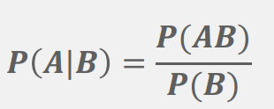
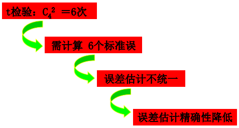
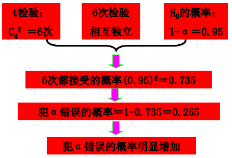

<a name="content">目录</a>

[学习笔记：生物统计学](#title)
- [概率与概率分布](#probability-and-distribution)
	- [古典概型](#classical-model)
	- [概率计算](#caculate-probability)
	- [概率分布](#probability-distribution)
	- [总体特征数](#whole-feature-value)
	- [几种常见的理论分布](#common-distributions)
		- [二项分布](#binomial-distribution)
		- [泊松分布](#poisson-distribution)
		- [正态分布](#normal-distribution)
	- [大数定律](#law-of-large-numbers)
- [抽样分布](#sampling-distribution)
	- [抽样试验与无偏估计](#unbiased-estimate)
	- [样本平均数的分布](#mean-distribution)
		- [中心极限定理](#central-limit-theorem)
	- [样本平均数差数的分布](#distribution-of-sample-mean-difference)
	- [t分布](#t-distribution)
- [方差分析：ANOVA](#anova)
	- [n次t检验的缺点](#disadvantage-of-multi-t-test)

<h1 name="title">学习笔记：生物统计学</h1>

<a name="probability-and-distribution"><h2>概率与概率分布 [目录](#content)</h2></a>

概率的统计定义：
> 在相同条件下进行n次重复试验，如果随机事件A发生的次数为m，那么m/n称为随机事件A的频率,当试验重复数n逐渐增大时，随机事件A的频率越来越稳定地接近某一数值p，那么就把 p 称为随机事件A的概率
>   
> 这样定义的概率称为**统计概率**(statistics probability)或**后验概率**(posterior probability)

<a name="classical-model"><h3>古典概型 [目录](#content)</h3></a>

古典概型（classical model)的特征：
> - 试验的所有**可能结果只有有限个**，即样本空间中的基本事件只有有限个;
> - 各个试验的可能结果出现的可能性相等，即所有基本事件的发生是**等可能**的;
> - 试验的所有可能结果**两两互不相容**

<a name="caculate-probability"><h3>概率计算 [目录](#content)</h3></a>

- 概率的加法法则

P(A∪B)=P(A)+P(B) - P(A∩B)

- 条件概率

- 概率乘法法则

P(AB)=P(A|B)P(B)

P(AB)=P(B|A)P(A)

- 全概率公式

- 贝叶斯公式

<a name="probability-distribution"><h3>概率分布 [目录](#content)</h3></a>

- **离散型随机变量**

- **连续型随机变量**

当试验资料为连续型变量，一般通过分组整理成频率分布表。如果从总体中抽取样本的容量n相当大，则频率分布就趋于稳定，我们将它近似地看成总体概率分布

<table>
<tr>
	<td></td>
	<td></td>
</tr>
</table>

当n无限大时，频率转化为概率，频率密度也转化为概率密度，阶梯形曲线也就转化为一条光滑的连续曲线，这时**频率分布**也就转化为**概率分布**了

曲线函数f(x)称为概率密度函数

分布函数F(x)定义：

<a name="whole-feature-value"><h3>总体特征数 [目录](#content)</h3></a>

- **离散型随机变量的期望与方差**

期望：E(x) = Σ xipi

方差：D(x) = Σ [ xi - E(x) ] 2 pi

- **连续型随机变量的期望和方差**

<a name="common-distributions"><h3>几种常见的理论分布 [目录](#content)</h3></a>

这几种分布的关系：

<a name="binomial-distribution"><h4>二项分布形式 (binomial distribution) [目录](#content)</h4></a>

n重贝努里试验 (Bernoulli trials) 为二项分布形式

在n重贝努利试验中，事件A恰好发生k(0≤k≤n)次的概率为

- **二项分布的形状**

当p值较小且n不大时，分布是偏倚的。随n的增大，分布趋于对称；

当p值趋于0.5时，分布趋于对称

- **期望与方差**

μ ＝ np

σ = sqrt(np(1-p))

<a name="poisson-distribution"><h4>波松分布 (poisson distribution) [目录](#content)</h4></a>

用来描述和分析随机地发生在单位空间或时间里的稀有事件的概率分布

服从波松分布的随机变量：

> - 一定畜群中某种患病率很低的非传染性疾病患病数或死亡数
> - 畜群中遗传的畸形怪胎数
> - 每升饮水中大肠杆菌数

若随机变量 x(x=k) 只取零和正整数值 0， 1， 2， … ，且其概率分布为

对于小概率事件，可用泊松分布描述其概率分布

二项分布当p<0.1和np<5时，可用泊松分布来近似

- **波松分布的形状**

λ是波松分布所依赖的唯一参数。 λ值愈小分布愈偏倚， 随着λ的增大 ， 分布趋于对称。 当λ=20时分布接近于正态分布；当λ=50时， 可以认为波松分布呈正态分布。 所以在实际工作中，当 **λ≥20** 时就可以用正态分布来近似地处理波松分布的问题。

- **波松分布的期望与方差**

μ= σ 2 = λ

- **波松分布的概率计算**

从所观察的随机样本中计算出相应的样本平均数作为 λ 的估计值，将其代替公式中的λ

<a name="normal-distribution"><h4>正态分布 (normal distribution) [目录](#content)</h4></a>

正态分布也称为高斯分布(Gauss distribution)

标准正态分布

<table>
<tr>
	<td></td>
	<td></td>
</tr>
</table>

- **正态分布的概率计算**

计算一般正态分布的概率，需要将一般正态分布转换为标准正态分布，实际上只要将区间的上下限作适当变换（标准化）

`[x1， x2]` => `[(x1-μ)/σ， (x2-μ)/σ]`

就可用查标准正态分布的概率表的方法求得概率了

几个常用的数值：

> P(μ-σ<x≤μ+σ) = P(-1≤u≤1) = 0.6826
>
> P(μ-2σ<x≤μ+2σ) = P(-2≤u≤2) = 0.9545
>
> P(μ-3σ<x≤μ+3σ) = P(-3≤u≤3) = 0.9973
>
> P(|x|≤μ+1.96σ) = P(-1.96≤u≤1.96) = 0.95
>
> P(|x|≤μ+2.58σ) = P(-2.58≤u≤2.58) = 0.99

- **正态分布的应用**

(1) 估计参考值范围

> 20株小麦株高(cm) 为82，79，85，84，86，84，83，82，83，83，84，81，80， 81， 82， 81， 82， 82， 82， 80。 其平均值为 82.3cm， 标准差为1.7502cm。问：小麦株高95%的正常范围值

(2) 质量控制

> 服从正态分布的变量落在μ±2σ 及μ±3σ的概率为95.45%和99.73%，在试验中，为了控制检测误差，常以 average(x) ± 2s作为上下警戒线，以 average(x) ± 3s作为上下控制线

(3) 正态分布是很多统计方法的理论基础

<a name="law-of-large-numbers"><h3>大数定律 [目录](#content)</h3></a>

概率论中用来阐述大量随机现象平均结果稳定性的一系列定律的总称

主要内容：样本容量越大， 样本统计量与总体参数之差越小

<a name="sampling-distribution"><h2>抽样分布 [目录](#content)</h2></a>

总体与样本的关系可以从两个方面研究
> - 由已知的总体，研究样本的分布规律，即由总体到样本的过程；研究样本的各种统计量的概率分布，即所谓的**抽样分布**(sampling distribution)
> 
>    简单来说，就是已知一个总体的分布类型，是正态还是二项或者是泊松分布，但是不知道在这种分布下的总体的数量特征，即期望与方差，想通过从总体中抽样出部分样本，根据样本对总体做出估计和推断
>
>    但由于从总体中抽取的样本提供的信息仅是总体的一部分， 因此它不能提供完全准确的信息， 必然存在着一定的误差
>
>    对于样本容量相同的多次随机抽样， 得到样本函数的观察值也是不同的， 且其取值有一定的概率， 即统计量也是一个随机变量， 因而也有它的分布，称为抽样分布(sampling distribution)
> 
> - 由样本推断未知的总体，属于从样本到总体的研究过程。 即**统计推断**问题

<a name="unbiased-estimate"><h3>抽样试验与无偏估计 [目录](#content)</h3></a>

如果所有可能样本的某一统计量的平均数等于总体的相应参数，则称该统计量为总体相应参数的**无偏估计值**

<a name="mean-distribution"><h3>样本平均数的分布 [目录](#content)</h3></a>

标准误的大小与原总体的标准差σ 成正比，与样本含量n的平方根成反比

从某特定总体抽样，因为σ是一定值，所以只有增大样本容量，才能降低样本平均数的抽样误差

在实际工作中，总体标准差 σ 往往是未知的，因而无法求得标准误。此时，可用样本标准差s估计总体标准差σ

<a name="central-limit-theorem"><h4>中心极限定理 [目录](#content)</h4></a>

如果被抽总体不是正态分布总体，但具有平均数μ和方差σ2 ，当随样本容量n的不断增大，样本平均数 x 的分布也越来越接近正态分布，且具有平均数μ，方差σ2 /n

不论总体为何种分布，只要是大样本，就可运用中心极限定理，认为样本平均数的分布是正态分布。在计算样本平均数出现的概率时，样本平均数可按下式进行标准化

<a name="distribution-of-sample-mean-difference"><h3>样本平均数差数的分布 [目录](#content)</h3></a>

(1) 样本平均数差数的平均数 = 总体平均数的差数

(2) 样本平均数差数的方差 = 两样本平均数方差之和

<a name="t-distribution"><h3>t分布 [目录](#content)</h3></a>

使用t分布的前提条件：

> - 总体标准差 σ 未知
>
> - 小样本(n<30)

所以上图中，前两种情况，样本均值符合正态分布，即符合u分布

而总体标准差 σ 未知，且为小样本，其样本均值近似正态分布，但不是正态分布，所以为t分布

和正态分布相比，t分布顶端偏低，尾部偏高，自由度 df > 30 时，其曲线接近正态分布曲线， df→∝时则和正态分布曲线重合

t分布受自由度df=n-1的制约，每个自由度都有一条t分布曲线

P { t ( df ) > tα } = α

几个重要的取值：
> P(t ≥ 2.228) + P(t ≤ −2.228) = 0.05
>
> P(t ≤ −1.812) = 0.05
>
> P(t ≥1.812) = 0.05

<a name="anova"><h2>方差分析：ANOVA [目录](#content)</h2></a>

用以检验两个或多个均数间差异的假设检验方法

<a name="disadvantage-of-multi-t-test"><h3>n次t检验的缺点 [目录](#content)</h3></a>

**是否可行？**

> 可以把多组数据化成n个两组数据（化整为零），用n次t检验来完成这个多组数据差异显著性的判断

- 1\. 检验过程烦琐

- 2\. 无统一的试验误差，误差估计的精确性和检验的灵敏性低

- 3\. 推断的可靠性低，检验时犯α错误概率大

例如我们用t检验的方法检验4个样本平均数之间的差异显著性

